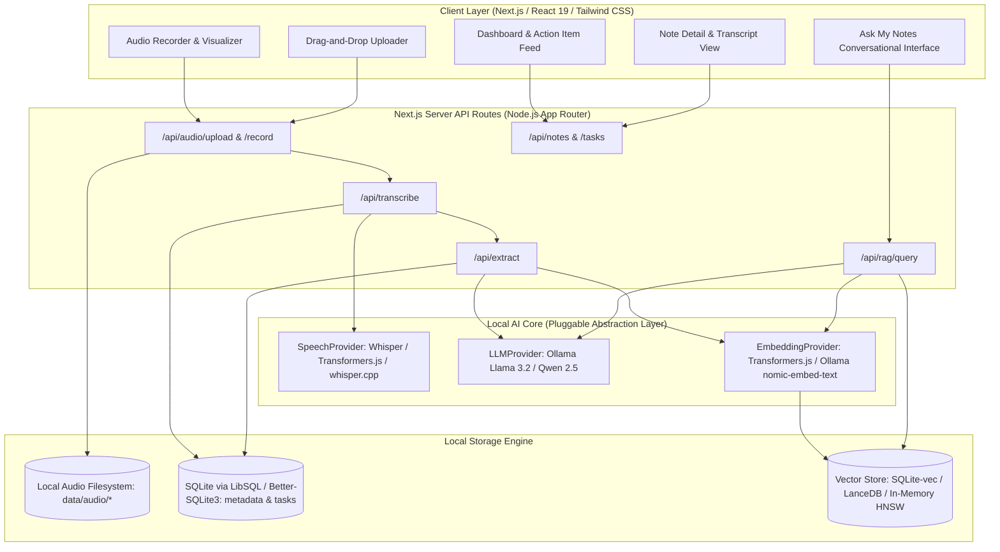
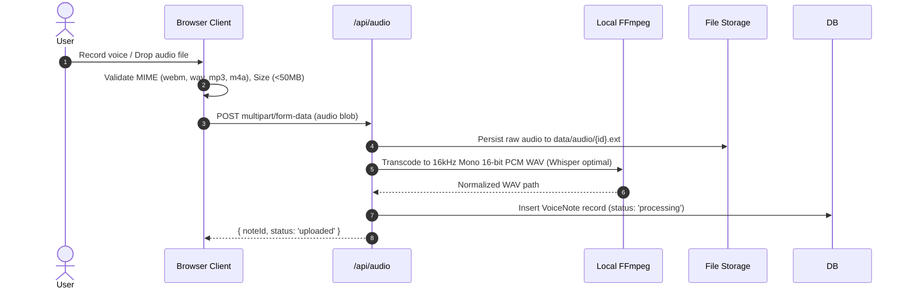
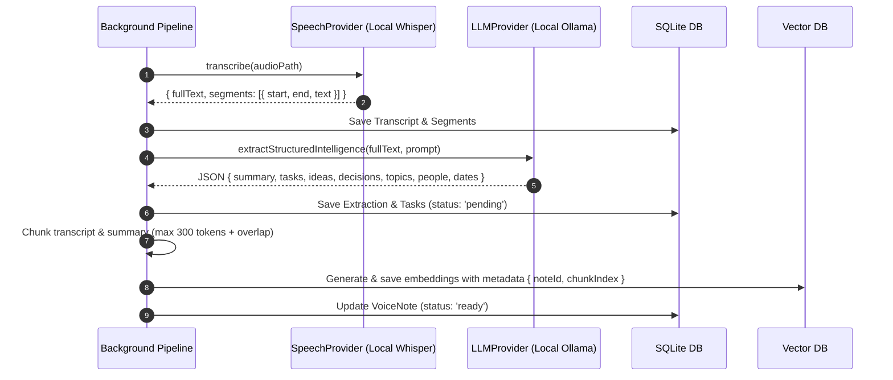
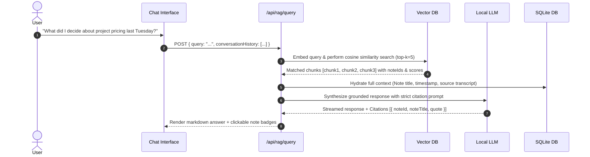
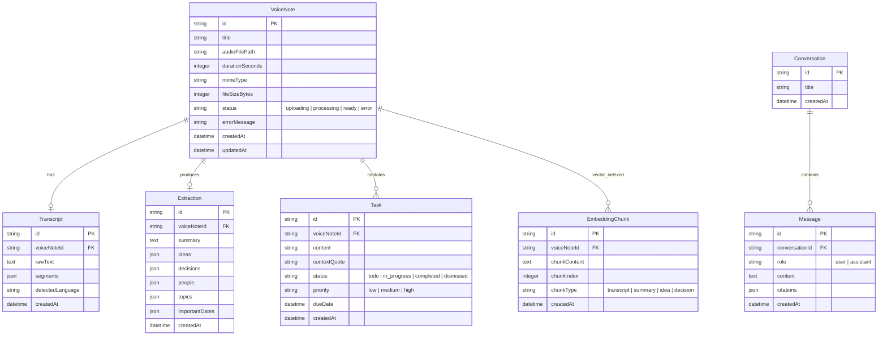
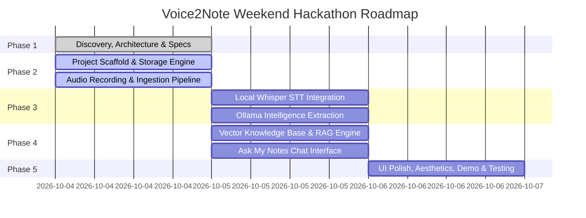

# Voice2Note — Architecture & System Design Document
*Turn messy voice recordings into searchable, actionable personal knowledge — privately.*

---

## 1. Executive Summary & Product Vision

**Voice2Note** is a local-first, privacy-respecting intelligence platform designed to solve the chronic "voice memo graveyard" problem. Users record voice notes while walking, driving, brainstorming, or after meetings, but audio recordings are opaque: they cannot be skimmed, searched semantically, or queried conversationally, and the action items embedded within them are routinely lost.

Voice2Note transforms this workflow through a 5-stage pipeline:
```
Voice Recording / Audio Upload
              ↓
  Local Speech-to-Text (STT)
              ↓
   Open-Weight LLM (Local)
              ↓
  Structured Intelligence Extraction
  (Summary, Actionable Tasks, Ideas, Decisions)
              ↓
  Local Knowledge Base & Vector Index
              ↓
  Semantic Search & "Ask My Notes" RAG
```

By operating **100% locally** (local STT + local LLM via Ollama + local vector embeddings + local SQLite storage), Voice2Note guarantees absolute confidentiality: voice recordings and personal reflections never leave the user's machine.

---

## 2. Primary User & Problem Framing

### 2.1 Configurable Persona Specification

Voice2Note is built around the "Build for a Friend" ethos. The application includes a configurable persona profile that can be customized to match the user's specific workflow:

```yaml
FRIEND_NAME: "Alex (Product Designer & Solopreneur)"
FRIEND_PROBLEM: >
  Records 5–10 unstructured audio memos every day while commuting, dog-walking,
  and pacing during design sprints. Memos accumulate in Apple Voice Memos with names
  like "New Recording 47.m4a". He loses commitments made to clients, brilliant UI
  ideas, and critical to-do items because re-listening to hours of raw audio is impossible.
FRIEND_WORKFLOW: >
  1. Captures quick voice notes on mobile or laptop mic throughout the day.
  2. Needs an instant end-of-day digest: "What do I actually need to do tomorrow?"
  3. Needs to query previous thoughts weeks later: "What did I decide about the onboarding flow?"
```

*(This configuration is abstracted into application settings, allowing seamless adaptation to any friend's specific profile).*

---

## 3. High-Level System Architecture



---

## 4. Technology Stack & Decision Matrix

| Layer | Selected Technology | Alternative Considered | Rationale for Selection |
|---|---|---|---|
| **Framework** | **Next.js (App Router, TypeScript)** | Vite + Express / FastAPI | Single codebase for React frontend and Node.js server routes. Zero IPC overhead, standard API routes, fast SSR, and native TypeScript support. |
| **Styling & UI** | **Tailwind CSS + shadcn/ui + Lucide Icons + Framer Motion** | Vanilla CSS / Material UI | Fast, highly aesthetic modern dark-mode UI with accessible primitives. Lightweight animations for recording visualizer and task completion. |
| **Local Speech-to-Text** | **Transformers.js (Whisper-tiny/base.en)** with fallback to **whisper.cpp / faster-whisper** | OpenAI Whisper API | Open-weight Whisper running locally via ONNX Runtime / WebAssembly in Node.js or whisper.cpp CLI. Zero API key requirement, zero data egress. |
| **Local LLM Engine** | **Ollama (`llama3.2:3b` / `llama3.2:1b` / `qwen2.5:3b`)** | llama.cpp server / MLX | Ollama is already installed and running on the target environment with active models. Standardized OpenAI-compatible HTTP interface on `localhost:11434`. Extremely low latency on Apple Silicon (M4). |
| **Local Vector DB** | **LanceDB** or **SQLite Vector (libsql / in-memory cosine index)** | Chroma / Pinecone | Zero-docker, embedded, runs directly in-process within Node.js, storing embeddings locally in a directory or SQLite file. |
| **Relational Storage** | **SQLite (via Drizzle ORM or better-sqlite3)** | PostgreSQL | Single-file database, zero setup, ACID compliant, backup-friendly, perfect for local-first desktop/web app. |
| **Audio Processing** | **Web Audio API (client) + FFmpeg (server)** | MediaRecorder alone | Client captures clean 16kHz WAV/WebM; FFmpeg handles format conversion and audio normalization on Apple Silicon. |

---

## 5. End-to-End Pipelines

### 5.1 Audio Ingestion & Normalization Pipeline



### 5.2 Transcription & Intelligence Extraction Pipeline



### 5.3 Retrieval-Augmented Generation (RAG) "Ask My Notes" Pipeline



---

## 6. AI Model Abstraction Layer

To ensure no tight coupling to any single framework or vendor, all AI capabilities are accessed strictly via TypeScript interfaces:

```typescript
// src/lib/ai/types.ts

export interface AudioInput {
  filePath: string;
  mimeType: string;
  durationSeconds?: number;
}

export interface TranscriptSegment {
  id: string;
  start: number;
  end: number;
  text: string;
  confidence?: number;
}

export interface TranscriptResult {
  text: string;
  language: string;
  duration: number;
  segments: TranscriptSegment[];
}

export interface SpeechProvider {
  id: string;
  name: string;
  transcribe(audio: AudioInput): Promise<TranscriptResult>;
}

export interface Message {
  role: 'system' | 'user' | 'assistant';
  content: string;
}

export interface GenerationOptions {
  temperature?: number;
  maxTokens?: number;
  responseFormat?: 'text' | 'json';
}

export interface LLMProvider {
  id: string;
  name: string;
  generate(messages: Message[], options?: GenerationOptions): Promise<string>;
  generateStream?(messages: Message[], options?: GenerationOptions): AsyncIterable<string>;
}

export interface EmbeddingProvider {
  id: string;
  name: string;
  dimensions: number;
  embed(text: string): Promise<number[]>;
  embedBatch(texts: string[]): Promise<number[][]>;
}
```

### Implementation Registry:
1. **`LocalWhisperSpeechProvider`**: Runs Transformers.js / whisper.cpp locally.
2. **`OllamaLLMProvider`**: Communicates with `http://localhost:11434` for Llama-3.2, Qwen-2.5, or Mistral.
3. **`LocalEmbeddingProvider`**: Uses `Xenova/all-MiniLM-L6-v2` (384-d) or Ollama `nomic-embed-text` (768-d).

---

## 7. Data Models & Entity Schema

The relational schema is maintained in SQLite with Drizzle ORM:



---

## 8. Intelligence Extraction Specification

To prevent hallucination, the extraction prompt enforces strict criteria:

```json
{
  "summary": "Concise 2-3 sentence overview of the recording.",
  "tasks": [
    {
      "content": "Action item clearly stated or committed to",
      "context": "Direct quote from recording explaining why",
      "priority": "low | medium | high",
      "dueDate": "ISO timestamp or null if not stated"
    }
  ],
  "ideas": [
    "Brainstormed concepts, project directions, or creative sparks"
  ],
  "decisions": [
    "Decisions finalized or agreed upon during the recording"
  ],
  "people": [
    "Names of individuals or teams mentioned"
  ],
  "topics": [
    "Keywords / domain tags"
  ],
  "importantDates": [
    {
      "event": "Deadline or scheduled event",
      "dateString": "Raw text phrase or ISO date"
    }
  ]
}
```

### Extraction Guardrails:
1. **Explicit vs. Inferred:** Tasks must have an accompanying `context` quote from the audio transcript.
2. **Conservative Extraction:** If no tasks or decisions are present, return an empty array `[]` rather than inventing speculative actions.
3. **Structured Format:** Enforce JSON schema mode in Ollama (`format: "json"`).

---

## 9. Privacy & Security Strategy

| Boundary | Policy | Implementation Detail |
|---|---|---|
| **Audio Data** | **100% Local Filesystem** | Audio files reside in `data/audio/`. No S3 bucket, no cloud egress. |
| **Speech-to-Text** | **100% On-Device** | Local Whisper model running via ONNX Runtime or native binary. |
| **LLM Inference** | **100% Localhost** | Sent solely to `http://localhost:11434` (Ollama). |
| **Vector Storage** | **100% In-Process** | Local embedded vector store on disk. |
| **Telemetry / Analytics**| **Disabled** | Zero external telemetry or tracking scripts. |
| **Network Boundary** | **Air-gap capable** | Application functions fully with network interfaces disconnected once models are initialized. |

---

## 10. UI/UX Specification

### Screens & Layout:
1. **Main App Shell:** Modern sidebar navigation (Dashboard, Record/Upload, Notes Archive, Task Board, Ask Notes, Settings).
2. **Dashboard (`/`):**
   - Hero: Instant record button with pulse animation + drag-and-drop audio dropzone.
   - Quick Metrics: Total voice notes, open tasks, recent ideas.
   - Processing Banner: Real-time progress indicator when notes are transcribing or extracting.
   - Recent Notes Grid with status badges.
3. **Record Modal / Dedicated View (`/record`):**
   - Real-time HTML5 Canvas audio waveform visualizer.
   - Timer, Pause, Resume, Stop, Preview audio player, Save / Discard controls.
4. **Note Detail (`/notes/[id]`):**
   - Integrated audio playback with timestamp-synchronized transcript highlighting.
   - Tabbed view: **AI Summary & Extracted Intelligence** (Tasks, Ideas, Decisions, People) vs. **Full Raw Transcript**.
   - One-click task checkbox toggling.
5. **Ask My Notes (`/ask`):**
   - Conversational chat interface for querying the entire personal knowledge base.
   - Interactive source citation cards linking directly to the specific note and audio timestamp.
6. **Settings (`/settings`):**
   - Local AI health-check status (Ollama connection, model selection: Llama 3.2 / Qwen, Whisper model status).
   - "Friend Persona" configuration editor (`FRIEND_NAME`, `FRIEND_WORKFLOW`).

---

## 11. Failure Modes & Graceful Degradation

| Failure Mode | Detection | User-Facing Action | Fallback Strategy |
|---|---|---|---|
| **Microphone Permission Blocked** | `navigator.mediaDevices.getUserMedia` rejects | Display clear in-app guide on granting browser mic permissions; provide audio file upload as immediate alternative. | File upload fallback. |
| **Ollama Service Down** | HTTP connection refused on `11434` | Banner: "Local LLM service (Ollama) is not running. Run `ollama serve`." | Audio & transcript are preserved; extraction is queued. |
| **Unsupported Audio Codec** | MIME type / header validation failure | Reject with message: "Format not supported. Please upload MP3, WAV, M4A, or WebM." | Client-side conversion if feasible, else rejection. |
| **Empty / Silent Audio** | Audio size < 2KB or zero RMS amplitude | "Audio appears to be silent or empty. Recording not saved." | Discard cleanly without polling AI pipelines. |
| **OOM / Model Crash** | Process termination or 504 timeout | Mark note status as `error` with a "Retry Extraction" button. | Queue retries with lower context length. |
| **Vector Search Mismatch** | Distance threshold > 0.75 | "No direct match found in your notes. Here is a general assessment based on available context." | Keyword BM25 fallback search on raw transcripts. |

---

## 12. Implementation Roadmap (Phases 2–5)



- **Phase 2 — Ingestion & Foundation:** Scaffold Next.js TypeScript project, Tailwind CSS, SQLite database schema, audio recording with Web Audio API visualizer, file upload validation, and local filesystem storage.
- **Phase 3 — AI Intelligence Core:** Implement `SpeechProvider` (Whisper), `LLMProvider` (Ollama Llama 3.2), prompt engineering for zero-hallucination structured JSON extraction, and task generation.
- **Phase 4 — Knowledge Base & RAG:** Local vector embeddings, chunking strategy, cosine similarity search, and interactive "Ask My Notes" conversational assistant with source citations.
- **Phase 5 — Polish, Verification & Demo:** End-to-end testing with real voice recordings, error handling polish, Friend Persona customization demo, and README walkthrough.
